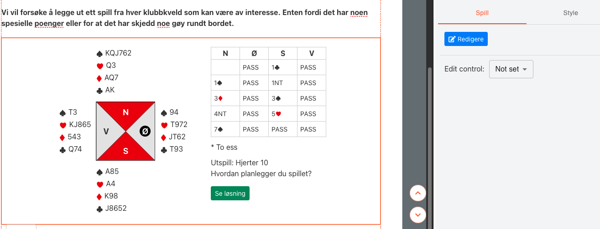
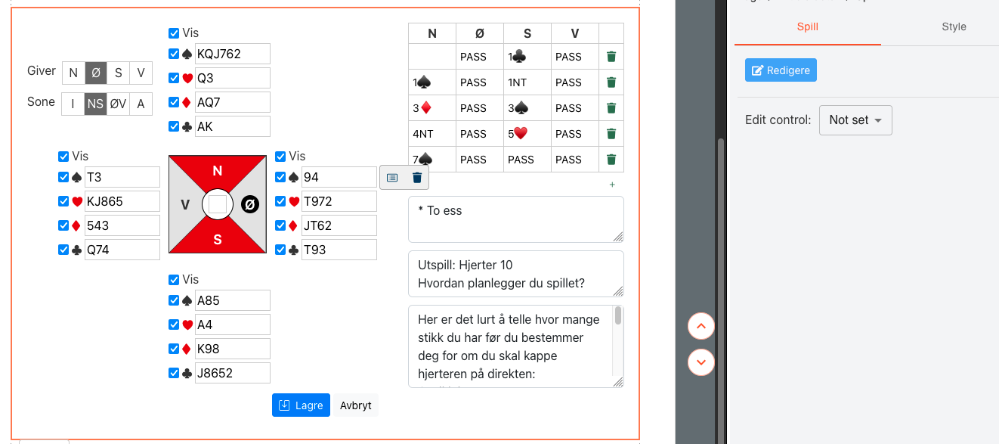
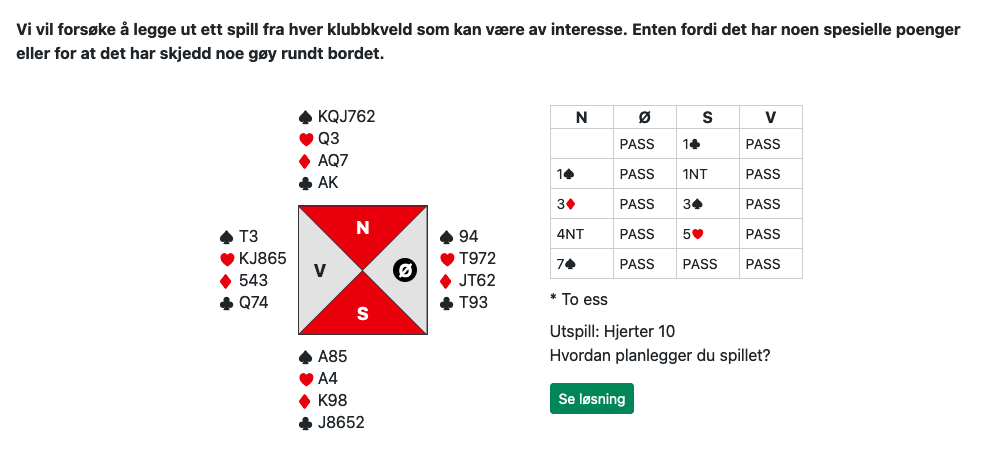
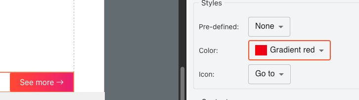
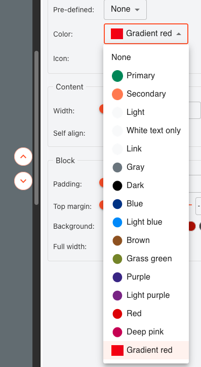

## DM Editor Concept

DM Editor provides a framework to develop widget and style easily, in the end brings good experience to editors. To better use DM Editor in application, some principle concepts are explained below.

### Widget

Widget is a block with functions. It can be basic like image, form, or mixed widget like hero-text which consists of other widgets.

There are 3 types of widgets:

- basic widget: an atom widget
- list: a container, eg. list, grid
- mixed: eg. hero-text, layouts or other widet which consists of widget(s) and custom rendering.

#### Try to put style out of widget implementation

If the widget has potential to have different theme, then it's recommanded that only function related css stays in the widget, theme related css better to be in `widget style` - even if it's called `Default style`.

Eg. Gallery, the image grid css can be in widget, while close button, previous, next can be in `widget style`.

#### Edit widget on left area or setting panel?

Short answer is it depends. DM Editor tries to make good editorial experience, so it supports both or mixed. In some widget like Form, it's better to use left area, but some widget like Gallery, it's better to put image on right.

Below is an example of Bridge play widget where it uses button on right to trigger edit mode.

When select block:

When click "Edit" button on setting panel:

Frontend:

In general there is a benefit of editing & viewing in one place - implement mainly edit, then view is easy - just output value.

### Widget style

Widget style is core concept of DM Editor. The idea behind is that widget focuses on function, widget styles focus on display theme. Most of time in a website, using style should cover most of design theme.

A good example is in button. A button can have size (small, medium), color (primary, secondary, etc), outline (fill/outline), round (no, small round, all round). All of those can be defined in button styles.

There are 2 types of styles: predefined and categorized. Predefined style is like: "project button" where all the size, color, outline, round are included. Categorized style is like above's size, color, outline, round. Try to use categorized style unless you are sure editor doesn't need flexibility of other style categories.

Here is how it looks with categorized styles (color and icon):

 

Categorized style (Color) selecting:

In addition, a widget style can set style settings (eg. padding) so editor can choose a style and adjust futher more in style settings.

### Share widgets between admin and frontend

It's recommanded to share common DM Editor code between frontend (eg. a nextjs project) and admin project - monorepo. Otherwise you will need to copy code between the 2 projects.

The code includes below:

- initial code
- widgets
- styles
- project styles
